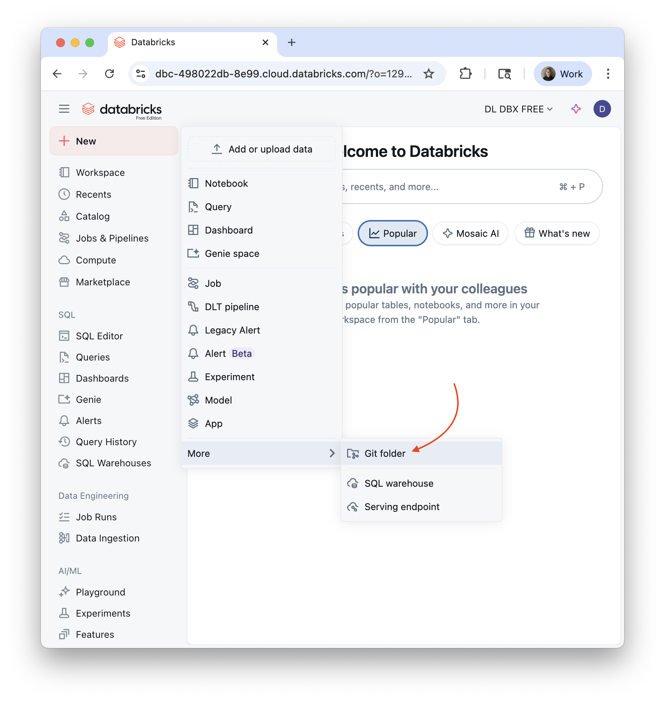

# Databricks Free Edition Demos

This repository contains a selection of demos covering a range of Databricks use cases, all compatible with the Databricks Free Edition.

## Chef Casper's Ghost Kitchen

All demos in this repository use Casper's Ghost Kitchen as a fictional business example.

A ghost kitchen is a commercial cooking facility designed exclusively for delivery orders: no dining room, just kitchen space optimized for fulfilling online orders. Multiple restaurant brands often operate from a single ghost kitchen facility.

This business model generates rich operational event data throughout the order lifecycle, from initial order placement, through kitchen preparation, driver assignment and pickup, real-time delivery tracking with GPS coordinates, to final delivery confirmation. Each order creates multiple timestamped events with detailed JSON payloads capturing everything from kitchen progress to driver location pings.

Casper's Ghost Kitchen processes hundreds of orders daily across multiple virtual restaurant brands, creating realistic datasets perfect for demonstrating data engineering, analytics, and AI applications with Databricks.

## Prerequisites

- Databricks Free Edition account
- Basic familiarity with Python and SQL
- No external data sources required: sample data is included!

## Getting Started

Getting started with these demos is simple. You just need to sign up for Databricks Free Edition, and then clone this repository.

### Sign up for Databricks Free Edition

You can sign up for Databricks Free Edition [here](https://login.databricks.com/?dbx_source=docs&intent=CE_SIGN_UP). To learn more about Free Edition, see the [Databricks Docs](https://docs.databricks.com/aws/en/getting-started/free-edition).

### Clone this repository

From the home page of your Databricks workspace, click the `+ New` button in the top right corner, then, under "more", select "Git folder".

Enter the URL of this repository (`https://github.com/chefcaspers/databricksfree`) and then click "Create Git folder". This will clone the repository into a new folder in your workspace.

### Run the demos

Each notebook in the repository's root directory is a standalone demo. You can run them in any order, and each one is designed to be self-contained. The demos are:

- [Agents](agents.ipynb): This demo shows how to register Unity Catalog functions and allow AI models to call them via the Databricks Mosaic AI Playground.
